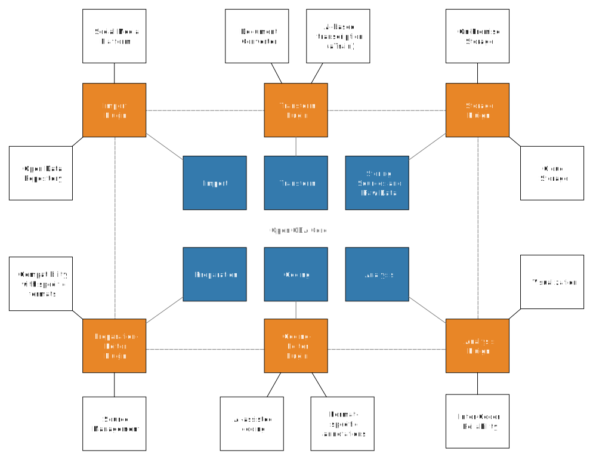

# OpenQDA Architecture

The envisioned software architecture for OpenQDA is a pluggable monolith:
There is a core application that can be extended by internal or external encapsulated
scripts or services that comply with a specific interface definition.

## Overview

## Plugins
One of the main goals of this architecture is to make it easy for you to extend OpenQDA
without the need to know its exact internals but by following only a few rules that
a plugin must comply with.

A plugin can thereby be a php module (backend), a JavaScript module or Vue component (frontend)
or an external service (both).

Read more about how to write and include a plugin in the [plugin guide](../plugins/overview.md).

## Server

The server architecture mostly follows the structures, given by Laravel.
Read more about it in the Laravel docs:

- [directory structure](https://laravel.com/docs/11.x/structure)
- [request lifecycle](https://laravel.com/docs/11.x/lifecycle)
- [service container](https://laravel.com/docs/11.x/container)
- [service providers](https://laravel.com/docs/11.x/providers)
- [facades](https://laravel.com/docs/11.x/facades)

## Client

We use [Vue 3](https://vuejs.org/) as our frontend engine, [vite](https://vite.dev) as bundler and
many Laravel-specific tools for communication with the backend (Echo, Intertia etc.).

Read more about, how the frontend relates to Laravel in their docs:

- [Laravel + Vue](https://laravel.com/docs/11.x/frontend#using-vue-react)
- [Inertia](https://inertiajs.com/)
- [Echo](https://laravel.com/docs/11.x/broadcasting)