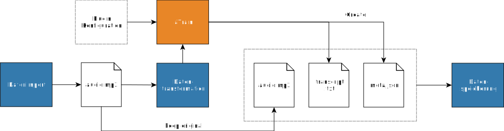

# Plugins and plugin development

One of the main goals of OpenQDA is to become pluggable in its major aspects.
This document provides an overview of the various pluggable steps of the QDA workflow
and their current state of implementation.

Here we document the current state of plugins that are implemented
and deployed to our live version at https://openqda.org

## Transform

**Description**
This steps takes the original input source and creates a new (transformed) output.

**Example usecases**

- Video/Audio conversion
- Text-file format conversions
- Transcription from audio/video

**State**

Implemented as proof of concept. 
An initial implementation of RTF conversion and audio transcription is implemented.

For the RTF Conversion we currently use a simple python-based application,
which will become a standalone service in the near future.

The transcription service (using [aTrain](https://github.com/JuergenFleiss/aTrain/tree/main/aTrain))
is a full standalone service application.

## Visualization

**Description**
This step takes all selections from all codes and sources and
provides them to a client-side visualization plugin.

**Example usecases**

- Create a Code Portrait

**State**
Implemented as proof of concept.
See [the visualization plugin guide](./visualization.md) on how to
create your own or extend the defaults.
